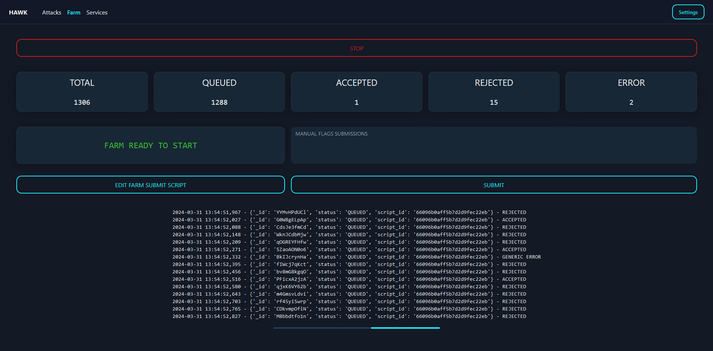
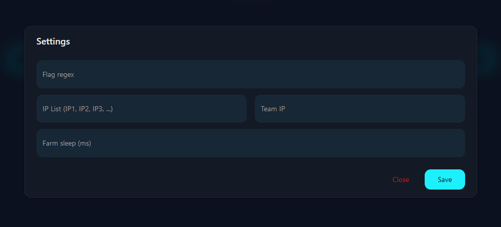
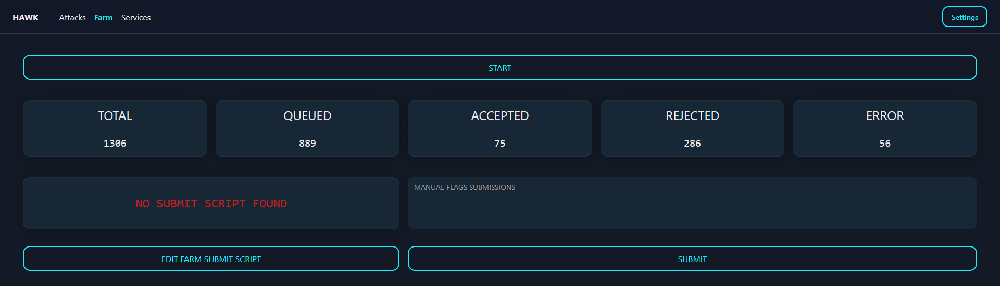

# HAWK - Farm for attack-defense CTF competitions 


---

## Description

This web service allows you to manage all the exploits written by the team in one place and on the other hand to automatically submit all the flags collected. In addition, it allows the user not to worry about the format of the flag and the hosts on which to launch the attacks.

## Components

### Attacks
All user-loaded scripts are started as pods on kubernetes, which allows scripts to be managed centrally and not have to depend on the player's PC.


### Farm
The farm allows the automatic sending of flags to the game server. Its operation depends on a script entered by the players so that the submission can be customised according to the way the game server accepts it. All the flags are stored in a DB. The database allows you to keep track of all the fags collected, so you can know the efficiency status of the scripts and avoid sending the same flag over and over again.



## Deploy

`⚠️ The following manifest was written and tested for a k3s cluster with StorageClass Longhorn. In case your environment is different, it is necessary to edit the file before proceeding ⚠️`

You can obtain in manifest for deployment via the following link:

```
https://raw.githubusercontent.com/M4RC02U1F4A4/hawk/main/manifest/hawk.yaml
```

Before deploying, change the `REACT_APP_API_BASE_URL` value in the configmap to the IP of the host on which the service runs, after that, you can apply the manifest

The deployed services will be accessible at the following addresses:
- WEB PORTAL -> `http://<HOST_IP>:30080`
- API -> `http://<HOST_IP>:30051`
- DB -> `http://<HOST_IP>:30017`

## Configuration
After starting the service, it is essential to fill in all the fields of the Settings



The required fields are as follows:
- `Flag regex` -> flag regexe, allows the automation of flag extraction from the output of the expoits
- `IP List` -> list of opponents' IPs, it is used to know to which address the exploits should be launched
- `Team IP` -> IP of your team, allows you to avoid launching expoits against your own team so you don't waste time and avoid submitting your own flags
- `Farm sleep` -> in milliseconds, time elapsing between the submit of the flags

`⚠️ In the event that these values are changed during the game, it is necessary to restart all attacks and the farm ⚠️`

The next step is to load the Python script that will be used to submit the flags



The flag will be passed automatically into `argv[1]`, the script must send the flag and end with one of the following exit codes:
- `0` -> Flag ACCEPTED
- `1` -> Flag REJECTED
- `2` -> GENERIC ERROR
- `3` -> Leave the flag in the QUEUE

Each exploit must be associated with a service, so the next step is to enter a recod for each service in the challenge


After creating the services, you can upload the exploits and start farming flags!

## Attack script format

Exploits must be written in Python and run only once. It will be up to the attack service to execute the script in a loop involving all the IPs of the opposing teams. The IP to which the attack is to be launched will be passed automatically into `argv[1]`.
The only requirement for exploits is that they print out a text containing flags in stdout; there is no need to do the flag extraction manually as it will be done automatically.

## Notes
- Each script must be accompanied by a requirements.txt file, in case they are not needed upload an empty file.

---

Developed by [M4RC02U1F4A4](https://github.com/M4RC02U1F4A4) with the help of [AndreaF17](https://github.com/AndreaF17) for the [K!nd4SUS CTF Team](https://github.com/K1nd4SUS)